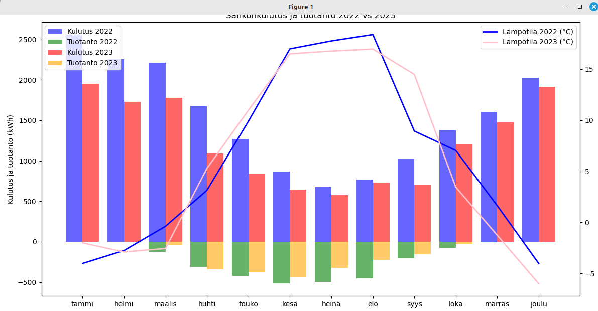
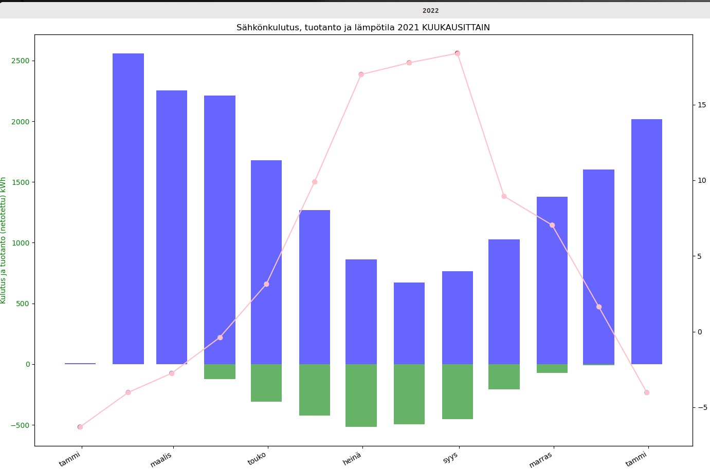
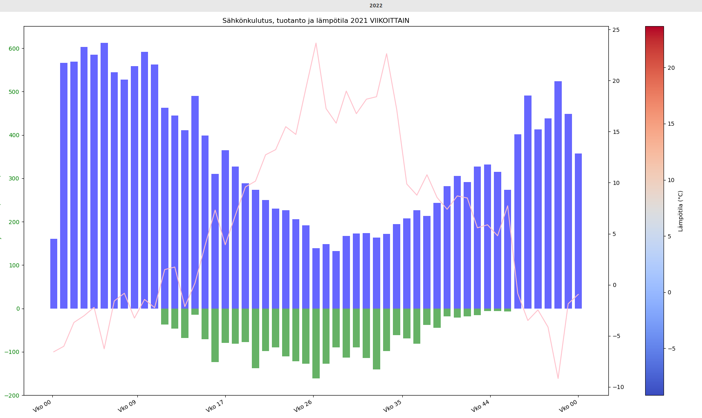
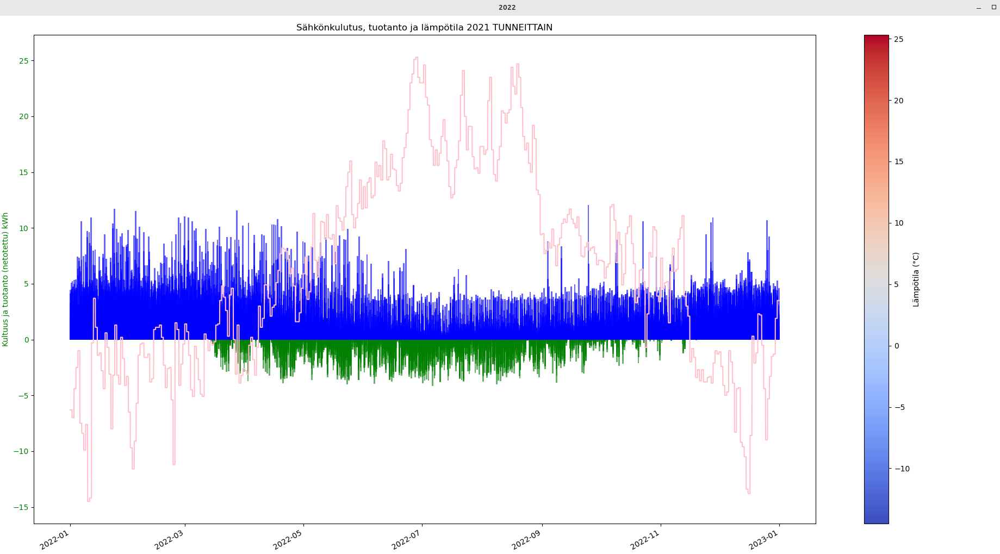

## Finnish Elenia electrocity company usage/production graphs

User can get an Elenia used/produced/temperature Excel sheet for their house. Due to the degradation of the Elenia website in the context of graphical presentation, here are some ways to produce visual diagrams using Python. One only needs to download the Excel data from the Elenia user portal.

*Example data used*: 2022.csv and 2023.csv

*KaksiVuottaKuukaudet.py*: Comparison diagram between two years

*KuukausiGraiikka.py*: One year monthly data

*ViikkoGrafiikka.py*: One year weekly data

*VuosiGraiikka.py*: One year hourly data

